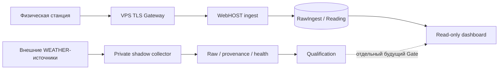

# Portal Air

Portal Air - это проект надёжного экологического мониторинга, в котором важен не только сам график измерений, но и возможность понять, **откуда взялось каждое значение, когда оно было измерено, когда получено сервером, что произошло при пропуске данных и можно ли доверять внешнему источнику**.

Проект вырос из практической задачи: принять данные от реальной станции на ESP8266 с существующей прошивкой NRZ-2024-135, не менять прошивку ради первого запуска, сохранить исходные запросы, нормализовать известные показатели, показывать пропуски честно и постепенно добавить независимый погодный контекст.

## Что Portal Air делает сегодня

В production работает основной тракт:

```text
Физическая станция NRZ
        ↓
контролируемый TLS-вход на VPS
        ↓
WebHOST PHP/MySQL
        ↓
RawIngest + Reading
        ↓
read-only dashboard
```

Система:

- принимает данные физической станции через защищённый TLS ingress;
- сохраняет безопасную raw-запись до нормализации;
- создаёт нормализованные измерения только для распознанных полей;
- сохраняет различие между временем измерения и временем получения;
- показывает пропуски вместо подстановки вымышленных значений;
- учитывает фактический cadence событий;
- хранит provenance, необходимый для последующего аудита данных.

## Что пока не является production

Отдельный WEATHER-контур реализован как private shadow environment. Он изолирован от production PM-тракта и выключен.

Текущее состояние внешних источников:

- AWC UHHH - ограниченный live path проверен;
- Meteostat - интеграционный runtime проверен offline, но запрос с текущего VPS получил HTTP 451;
- Narodmon - исследован как потенциальный источник локальных crowdsourced observations, но автоматический сбор не активирован;
- Open-Meteo - рассматривается только как MODEL/FORECAST context, а не как физическое наблюдение станции.

## Зачем здесь столько внимания к "неудобным" деталям

Обычный вариант "датчик отправил число → сайт нарисовал график" плохо отвечает на вопросы:

- данные отсутствуют потому, что воздух был чистым, или потому что пакет не дошёл?
- это реальное измерение или модель?
- измерение было сделано сейчас или дошло с задержкой?
- повторный пакет - новое измерение или дубль?
- аэропортовая метеостанция действительно описывает условия возле локального датчика?
- резервная копия действительно восстанавливается или просто существует как файл?

Portal Air строится так, чтобы эти различия не терялись.

## Архитектура



WEATHER-контур не имеет скрытого пути записи в production PM-данные.

## Что этот репозиторий может дать разработчику похожей системы уже сейчас

Даже без копирования проекта "один в один" здесь полезны уже проверенные инженерные решения и отрицательные результаты:

- как сначала установить реальный wire protocol устройства, а не проектировать backend по догадкам;
- как строить raw-first ingest;
- как отделить identity устройства от похожих, но неэквивалентных идентификаторов;
- как обходить ограничения старой embedded TLS-реализации через контролируемый gateway;
- как отличать отсутствие данных от причины отсутствия;
- как сохранять provenance внешних погодных источников;
- как не считать два API независимыми, если они перепубликовывают один upstream;
- как проектировать shadow-интеграции без риска загрязнить production;
- как проверять backup через реальный restore;
- какие проблемы возникают на границе Windows/Linux/systemd/shared hosting/API provider restrictions.

Это не готовая универсальная платформа и не обещание "развернуть за пять минут". Но набор архитектурных решений, тестовых подходов, failure model и задокументированных тупиков способен убрать значительную часть исследовательской работы при создании сходной системы. Точное количество сэкономленного времени зависит от оборудования, хостинга, прошивки и требований.

## Текущий статус

На момент этой публичной редакции:

- production ingest/dashboard - работает и проверен;
- Git recovery backup - проверен;
- private WebHOST recovery checkpoint - проверен;
- VPS off-host recovery checkpoint - `VERIFIED WITH DOCUMENTED RECOVERY LIMIT`;
- fresh database restore текущего checkpoint - **FAILED**, логическая эквивалентность не подтверждена;
- `FULL_DR_READINESS = PARTIAL`;
- `PROJECT_CHECKPOINT = INCOMPLETE`.

Это намеренно отражено публично: наличие SQL-файла не считается доказанной резервной копией, пока восстановление не прошло независимую проверку.

## Документация

1. [Назначение проекта](docs/01_PROJECT_PURPOSE.md)
2. [Архитектура](docs/02_ARCHITECTURE.md)
3. [Данные и provenance](docs/03_DATA_TRUST_AND_PROVENANCE.md)
4. [Надёжность и модель отказов](docs/04_RELIABILITY_AND_FAILURES.md)
5. [WEATHER-источники](docs/05_WEATHER_SOURCES.md)
6. [Модель безопасности](docs/06_SECURITY_MODEL.md)
7. [Текущий статус](docs/07_STATUS.md)
8. [Roadmap](docs/08_ROADMAP.md)
9. [Инженерные уроки и реальные проблемы](docs/09_ENGINEERING_LESSONS.md)
10. [Что может переиспользовать следующий разработчик](docs/10_FOR_FOLLOWERS.md)
11. [Практический checklist для сходного проекта](docs/11_REUSE_CHECKLIST.md)

Внутренние coordination/evidence/checkpoint материалы намеренно не являются частью этого публичного комплекта.
