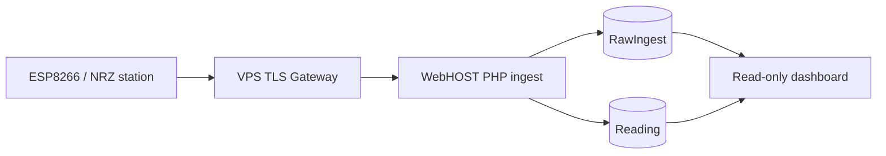
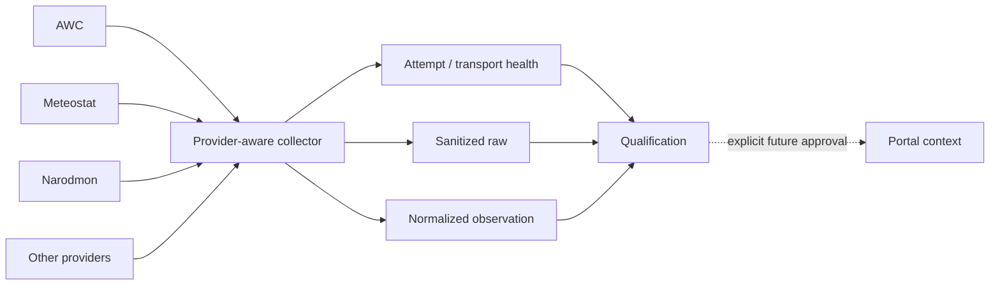

# 2. Архитектура

## Production path

### Почему между устройством и WebHOST появился VPS gateway

Первоначальная попытка отправлять физическую ESP8266 напрямую на shared-hosting HTTPS столкнулась не с PHP или размером JSON, а с transport-level TLS incompatibility.

Фактическая NRZ-2024-135 использует ограниченный TLS receive buffer и поддерживает MFLN 1024. Shared-hosting TLS frontend не согласовывал подходящий MFLN/record behavior, поэтому соединение завершалось до HTTP request.

Контролируемый VPS ingress позволил:

- согласовать совместимый TLS 1.2/MFLN;
- ограничивать и проверять HTTP boundary;
- нормализовать path без redirect для embedded-клиента;
- отделить constrained device от заменяемого backend;
- проверять transport отдельно от application layer.

Это один из ключевых архитектурных выводов проекта: **для старого embedded-клиента совместимость HTTPS в браузере ничего не гарантирует**.

## Raw-first ingest

При приёме запроса система сначала сохраняет безопасное raw evidence и только затем пытается нормализовать поля.

Причины:

- malformed/partial payload всё равно представляет диагностическую ценность;
- новая версия прошивки может прислать неизвестное поле;
- parsing bug не должен уничтожать факт получения запроса;
- позже можно повторно проверить parser относительно исходного packet.

Секретные headers/credentials при этом не должны сохраняться.

## Identity

Проект отдельно проверил, что аппаратный MAC и protocol identity могут выглядеть похоже, но не быть одной строкой.

Identity должна определяться по фактическому wire contract, а не по человеческому предположению о "MAC устройства".

## Private WEATHER architecture

Shadow collector изолирован от PM production data path.

## Почему не делается "один большой backend сразу"

Проект сознательно разделяет:

- transport;
- ingest;
- persistence;
- presentation;
- external provider collection;
- qualification;
- future firmware.

Это уменьшает blast radius: эксперимент с новым погодным API не должен иметь возможность изменить production readings основной станции.
